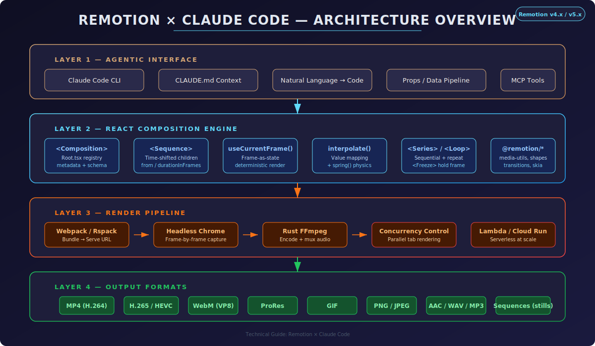
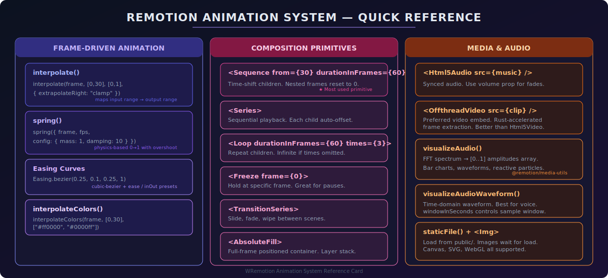
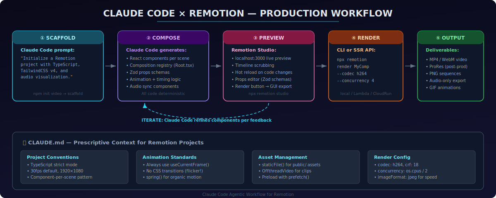

# Remotion × Claude Code: 종합 기술 가이드

**고급 실무자를 위한 프로그래매틱 영상 제작**

> **대상 독자**: Claude Code, 에이전틱 AI 워크플로우, 소프트웨어 엔지니어링, 음악 프로덕션, 멀티미디어 저작에 두루 숙달된 시니어 개발자 및 크리에이터
>
> **Remotion 버전**: v4.x / v5.x (최신 안정 버전: `4.0.435`, 2026년 3월 기준)
>
> **사전 요구사항**: Node.js ≥ 18, React + TypeScript 실무 능력, Claude Code CLI 사용 경험

---

## 목차

1. [아키텍처 개요](#1-아키텍처-개요)
2. [Claude Code를 활용한 환경 구성](#2-claude-code를-활용한-환경-구성)
3. [핵심 개념 — 결정론적 렌더링 모델](#3-핵심-개념--결정론적-렌더링-모델)
4. [애니메이션 시스템 심층 분석](#4-애니메이션-시스템-심층-분석)
5. [오디오 및 음악 통합](#5-오디오-및-음악-통합)
6. [복합 프로덕션을 위한 컴포지션 패턴](#6-복합-프로덕션을-위한-컴포지션-패턴)
7. [CLAUDE.md — Remotion 프로젝트 전용 처방적 컨텍스트](#7-claudemd--remotion-프로젝트-전용-처방적-컨텍스트)
8. [렌더 파이프라인 및 출력 최적화](#8-렌더-파이프라인-및-출력-최적화)
9. [스케일링: Lambda, Cloud Run, 배치 렌더링](#9-스케일링-lambda-cloud-run-배치-렌더링)
10. [고급 레시피](#10-고급-레시피)
11. [트러블슈팅 및 성능 튜닝](#11-트러블슈팅-및-성능-튜닝)
12. [라이선싱](#12-라이선싱)
13. [참고 자료](#13-참고-자료)

---

## 1. 아키텍처 개요

Remotion은 영상을 **시간에 따른 프레임의 함수**로 취급한다. 각 프레임은 React 컴포넌트 렌더링 결과물이며, 헤드리스 Chrome이 이를 캡처하고, 내장된 Rust 가속 FFmpeg 바이너리가 영상으로 스티칭한다. Claude Code는 이 스택의 최상위에서 에이전틱 인터페이스 역할을 수행하며, 자연어 의도를 결정론적 React 컴포지션으로 변환한다.



4계층 아키텍처 구성:

**Layer 1 — 에이전틱 인터페이스 (Claude Code)**: 씬, 전환, 데이터 바인딩, 오디오 싱크 요구사항을 자연어로 기술하면, Claude Code가 TypeScript 컴포넌트, Zod prop 스키마, 컴포지션 등록, 렌더 스크립트를 생성한다. `CLAUDE.md` 파일이 처방적 컨텍스트를 제공하여 에이전트가 재프롬프팅 없이 프로젝트 컨벤션을 준수하도록 한다.

**Layer 2 — React 컴포지션 엔진**: Remotion의 시간 프리미티브가 포함된 표준 React. 모든 애니메이션은 `useCurrentFrame()`으로 구동된다 — CSS 트랜지션, `requestAnimationFrame` 호출, 벽시계(wall-clock) 의존성이 일체 없다. 이것이 머신과 환경에 관계없이 렌더링을 결정론적으로 만드는 핵심이다.

**Layer 3 — 렌더 파이프라인**: Webpack(또는 실험적 Rspack)이 프로젝트를 번들링한다. 헤드리스 Chrome Shell이 브라우저 탭을 열고(동시성 설정 가능), 각 프레임을 JPEG/PNG로 렌더링하며, Remotion의 Rust-FFmpeg 바이너리가 출력을 인코딩한다. 메모리가 허용하면 병렬 인코딩이 적용된다.

**Layer 4 — 출력 포맷**: H.264, H.265, VP8/WebM, ProRes, GIF, PNG 시퀀스, 오디오 전용(AAC/WAV/MP3). 지원 플랫폼에서는 하드웨어 가속 인코딩도 사용 가능하다.

---

## 2. Claude Code를 활용한 환경 구성

### 2.1 프로젝트 스캐폴딩

가장 빠른 경로는 Claude Code에게 단일 프롬프트로 Remotion 프로젝트를 스캐폴딩하는 것이다:

```
Claude Code 프롬프트:
"./my-video에 TypeScript strict 모드, @remotion/tailwind-v4를 통한 TailwindCSS v4,
오디오 시각화를 위한 @remotion/media-utils 패키지를 포함하는 새 Remotion 프로젝트를
초기화해줘. 1920x1080, 30fps, 10초 길이의 'Main'이라는 단일 컴포지션을 등록하고,
src/compositions/, src/components/, public/ 디렉토리 구조를 설정해줘."
```

내부적으로 실행되는 명령:

```bash
npx create-video@latest my-video --template-type typescript
cd my-video
npm install @remotion/media-utils @remotion/tailwind-v4 @remotion/shapes @remotion/transitions
```

### 2.2 프로젝트 구조

잘 정리된 Remotion 프로젝트의 레이아웃:

```
my-video/
├── CLAUDE.md                    # Claude Code용 처방적 컨텍스트
├── remotion.config.ts           # 렌더 설정
├── src/
│   ├── Root.tsx                 # 컴포지션 레지스트리
│   ├── compositions/
│   │   ├── Main.tsx             # 메인 컴포지션
│   │   ├── Intro.tsx            # 씬 컴포넌트
│   │   └── Outro.tsx
│   ├── components/
│   │   ├── AnimatedTitle.tsx    # 재사용 가능한 애니메이션 요소
│   │   ├── AudioVisualizer.tsx
│   │   └── TransitionWipe.tsx
│   ├── hooks/
│   │   └── useAudioSpectrum.ts  # 커스텀 훅
│   ├── lib/
│   │   ├── animations.ts        # 공유 애니메이션 유틸리티
│   │   ├── colors.ts            # 디자인 토큰
│   │   └── timing.ts            # 재생시간/프레임 계산
│   └── schemas/
│       └── props.ts             # 입력 props용 Zod 스키마
├── public/
│   ├── music/                   # 오디오 에셋
│   ├── fonts/                   # 커스텀 폰트
│   └── images/                  # 정적 이미지
└── out/                         # 렌더링 출력물
```

### 2.3 Root.tsx — 컴포지션 레지스트리

```tsx
// src/Root.tsx
import { Composition } from "remotion";
import { Main } from "./compositions/Main";
import { mainSchema, type MainProps } from "./schemas/props";

export const RemotionRoot: React.FC = () => {
  return (
    <>
      <Composition
        id="Main"
        component={Main}
        durationInFrames={300} // 30fps 기준 10초
        fps={30}
        width={1920}
        height={1080}
        schema={mainSchema}
        defaultProps={{
          title: "Hello Remotion",
          accentColor: "#61dafb",
          musicFile: "music/track.mp3",
        }}
      />
    </>
  );
};
```

### 2.4 타입 안전 Props를 위한 Zod 스키마

Zod로 정의된 Props는 Remotion Studio GUI에서 편집할 수 있게 된다 — Claude Code와의 반복 작업에서 매우 강력한 피드백 루프를 형성한다:

```tsx
// src/schemas/props.ts
import { z } from "zod";

export const mainSchema = z.object({
  title: z.string().describe("메인 타이틀 텍스트"),
  accentColor: z.string().regex(/^#[0-9a-fA-F]{6}$/).describe("액센트 컬러 hex"),
  musicFile: z.string().describe("public/ 내 음악 파일 경로"),
});

export type MainProps = z.infer<typeof mainSchema>;
```

---

## 3. 핵심 개념 — 결정론적 렌더링 모델

### 3.1 상태로서의 프레임(Frame as State)

Remotion의 근본적 통찰: **모든 프레임은 프레임 번호의 순수 함수**다. 프레임 간에 누적되는 가변 상태가 존재하지 않는다. Chrome이 프레임 150을 캡처할 때, *오직* 프레임 150만 렌더링한다 — 프레임 0~149는 실행되지 않는다. CSS 트랜지션, `setTimeout`, `requestAnimationFrame`이 금지되는 이유가 바로 여기에 있다.

```tsx
import { useCurrentFrame, useVideoConfig, AbsoluteFill } from "remotion";

export const MyScene: React.FC = () => {
  const frame = useCurrentFrame();             // 0, 1, 2, ... durationInFrames-1
  const { fps, width, height } = useVideoConfig();
  const seconds = frame / fps;                 // 연속 시간

  return (
    <AbsoluteFill style={{ backgroundColor: "#0a0a0a" }}>
      <div style={{
        transform: `translateX(${frame * 2}px)`,
        opacity: Math.min(1, frame / 30),
      }}>
        Frame {frame} — {seconds.toFixed(2)}s
      </div>
    </AbsoluteFill>
  );
};
```

### 3.2 결정론이 중요한 이유

이 속성이 병렬 렌더링을 가능하게 한다: Remotion은 N개의 브라우저 탭을 열어 각각에 서로소인 프레임 집합을 할당할 수 있다. 프레임 500은 첫 번째로 계산되든, 마지막으로 계산되든, 격리 상태에서 계산되든 동일하게 렌더링된다. 이것이 Lambda/Cloud Run 분산을 가능하게 하는 원리다 — 각 서버리스 함수가 독립적으로 청크를 렌더링하면, 결과가 완벽하게 병합된다.

### 3.3 컴포지션 모델

```
┌─ Composition ──────────────────────────────────────────────────────┐
│  id="Main"  fps=30  width=1920  height=1080  duration=300 frames   │
│                                                                     │
│  ┌─ Sequence from=0 ──────────┐  ┌─ Sequence from=90 ──────────┐  │
│  │  <Intro />                  │  │  <ContentScene />            │  │
│  │  durationInFrames=90        │  │  durationInFrames=150        │  │
│  │  (0s → 3s)                  │  │  (3s → 8s)                   │  │
│  └─────────────────────────────┘  └──────────────────────────────┘  │
│                                                                     │
│  ┌─ Sequence from=240 ─────────┐                                   │
│  │  <Outro />                   │                                   │
│  │  durationInFrames=60         │                                   │
│  │  (8s → 10s)                  │                                   │
│  └──────────────────────────────┘                                   │
└─────────────────────────────────────────────────────────────────────┘
```

핵심 인사이트: **`<Sequence>` 내부에서는 `useCurrentFrame()`이 0으로 리셋**된다. `from=90`에 위치한 씬은 글로벌 타임라인이 프레임 90일 때 자체 프레임 0을 인식한다. 이 덕분에 씬들이 조합 가능(composable)하고, 애니메이션 타이밍을 재설정하지 않고도 순서를 변경할 수 있다.

---

## 4. 애니메이션 시스템 심층 분석



### 4.1 `interpolate()` — 핵심 워크호스

숫자 입력 범위를 출력 범위에 매핑한다. 프로그래밍 가능한 키프레임 시스템이라고 생각하면 된다:

```tsx
import { interpolate, Easing } from "remotion";

const frame = useCurrentFrame();

// 30프레임에 걸친 선형 페이드인
const opacity = interpolate(frame, [0, 30], [0, 1], {
  extrapolateRight: "clamp",  // 1.0을 초과하지 않음
});

// ease-in-out 좌측에서 슬라이드
const translateX = interpolate(frame, [0, 60], [-200, 0], {
  extrapolateLeft: "clamp",
  extrapolateRight: "clamp",
  easing: Easing.bezier(0.25, 0.1, 0.25, 1),
});

// 멀티 키프레임: 등장, 유지, 사라짐
const scale = interpolate(
  frame,
  [0,   15,  45,  60],   // 키프레임 위치
  [0,   1,   1,   0],    // 각 키프레임에서의 값
  { extrapolateLeft: "clamp", extrapolateRight: "clamp" }
);
```

### 4.2 `spring()` — 물리 기반 모션

`from`에서 `to`로 질량(mass), 감쇠(damping), 강성(stiffness)을 설정하여 애니메이션하는 값을 반환한다. 오버슈트가 자연스럽고 유기적인 모션을 만들어낸다:

```tsx
import { spring, useCurrentFrame, useVideoConfig } from "remotion";

const frame = useCurrentFrame();
const { fps } = useVideoConfig();

const scale = spring({
  frame,
  fps,
  from: 0,
  to: 1,
  config: {
    mass: 0.8,       // 가벼울수록 빠름
    damping: 12,     // 높을수록 바운스 감소
    stiffness: 200,  // 높을수록 스냅감 증가
  },
});

// 지연된 스프링 (프레임 20에서 시작)
const delayedScale = spring({
  frame: frame - 20,  // 음수 프레임은 `from` 값을 반환
  fps,
});
```

**Pro tip**: `measureSpring()`으로 정확한 재생 시간을 계산한 뒤, 시퀀스의 `durationInFrames` 설정에 활용하면 픽셀 퍼펙트한 타이밍을 구현할 수 있다.

### 4.3 `interpolateColors()` — 부드러운 색상 전환

```tsx
import { interpolateColors } from "remotion";

const color = interpolateColors(
  frame,
  [0, 30, 60, 90],
  ["#ff6b6b", "#feca57", "#48dbfb", "#ff9ff3"]
);
```

### 4.4 컴포지션 프리미티브 — 시간 레이어 쌓기

```tsx
import { Series, Sequence, Loop, Freeze, AbsoluteFill } from "remotion";

// Series: 순차 재생 (각 자식이 이전 자식 뒤에 이어짐)
<Series>
  <Series.Sequence durationInFrames={90}>
    <IntroScene />
  </Series.Sequence>
  <Series.Sequence durationInFrames={150}>
    <MainContent />
  </Series.Sequence>
  <Series.Sequence durationInFrames={60}>
    <OutroScene />
  </Series.Sequence>
</Series>

// Loop: 콘텐츠 반복
<Loop durationInFrames={30} times={4}>
  <PulseEffect />
</Loop>

// Freeze: 특정 프레임에서 고정
<Freeze frame={0}>
  <AnimatedTitle />  {/* 첫 번째 프레임에서 고정 */}
</Freeze>
```

### 4.5 TransitionSeries — 씬 전환

```tsx
import { TransitionSeries, linearTiming } from "@remotion/transitions";
import { slide } from "@remotion/transitions/slide";
import { fade } from "@remotion/transitions/fade";

<TransitionSeries>
  <TransitionSeries.Sequence durationInFrames={90}>
    <SceneA />
  </TransitionSeries.Sequence>
  <TransitionSeries.Transition
    presentation={slide({ direction: "from-right" })}
    timing={linearTiming({ durationInFrames: 15 })}
  />
  <TransitionSeries.Sequence durationInFrames={120}>
    <SceneB />
  </TransitionSeries.Sequence>
  <TransitionSeries.Transition
    presentation={fade()}
    timing={linearTiming({ durationInFrames: 20 })}
  />
  <TransitionSeries.Sequence durationInFrames={90}>
    <SceneC />
  </TransitionSeries.Sequence>
</TransitionSeries>
```

---

## 5. 오디오 및 음악 통합

음악 프로덕션 배경을 가진 실무자에게 Remotion의 오디오 파이프라인은 프레임 단위의 정확한 동기화를 제공한다 — 드리프트 없음, 싱크 문제 없음, 타이밍 핵 없음.

### 5.1 기본 오디오 삽입

```tsx
import { Html5Audio, staticFile, Sequence } from "remotion";

// 풀 트랙 오디오
<Html5Audio src={staticFile("music/track.mp3")} />

// 볼륨 엔벨로프 (페이드인/아웃)
const frame = useCurrentFrame();
const { durationInFrames } = useVideoConfig();

const volume = interpolate(
  frame,
  [0, 30, durationInFrames - 30, durationInFrames],
  [0, 1, 1, 0],
  { extrapolateLeft: "clamp", extrapolateRight: "clamp" }
);

<Html5Audio src={staticFile("music/track.mp3")} volume={volume} />
```

### 5.2 오디오 시각화 — 스펙트럼 분석

`@remotion/media-utils` 패키지가 프레임 단위로 실행되는 FFT 기반 스펙트럼 분석을 제공한다:

```tsx
import { useAudioData, visualizeAudio } from "@remotion/media-utils";
import { useCurrentFrame, useVideoConfig, staticFile, Html5Audio } from "remotion";

const music = staticFile("music/track.mp3");

export const SpectrumVisualizer: React.FC = () => {
  const frame = useCurrentFrame();
  const { fps, width, height } = useVideoConfig();
  const audioData = useAudioData(music);

  if (!audioData) return null;

  const spectrum = visualizeAudio({
    fps,
    frame,
    audioData,
    numberOfSamples: 64,   // 2의 거듭제곱: 16, 32, 64, 128...
    smoothing: true,        // 인접 프레임과 평균화
  });
  // spectrum: number[] — 각 값 0..1
  // 인덱스 0 = 최저 주파수(베이스), 마지막 인덱스 = 최고 주파수(트레블)

  const barWidth = width / spectrum.length;

  return (
    <AbsoluteFill style={{ backgroundColor: "#0a0a0a" }}>
      <Html5Audio src={music} />
      <svg viewBox={`0 0 ${width} ${height}`}>
        {spectrum.map((amplitude, i) => {
          const barHeight = amplitude * height * 0.8;
          const hue = (i / spectrum.length) * 360;
          return (
            <rect
              key={i}
              x={i * barWidth}
              y={height - barHeight}
              width={barWidth - 2}
              height={barHeight}
              fill={`hsl(${hue}, 80%, 60%)`}
              rx={2}
            />
          );
        })}
      </svg>
    </AbsoluteFill>
  );
};
```

### 5.3 웨이브폼 시각화 (음성/팟캐스트)

음성 기반 콘텐츠의 경우, `visualizeAudioWaveform()`이 시간 도메인 데이터를 제공한다:

```tsx
import { visualizeAudioWaveform } from "@remotion/media-utils";

const waveform = visualizeAudioWaveform({
  fps,
  frame,
  audioData,
  numberOfSamples: 128,
  windowInSeconds: 1 / fps,  // 한 프레임 분량의 오디오
});
// waveform: number[] — -1에서 1 사이의 값
```

### 5.4 오디오 리액티브 애니메이션 패턴

가장 강력한 기법: 오디오 데이터로 시각적 매개변수를 구동하는 방식:

```tsx
export const AudioReactiveScene: React.FC = () => {
  const frame = useCurrentFrame();
  const { fps } = useVideoConfig();
  const audioData = useAudioData(staticFile("music/track.mp3"));

  if (!audioData) return null;

  const spectrum = visualizeAudio({ fps, frame, audioData, numberOfSamples: 8 });

  // 주파수 밴드 추출
  const bass = spectrum[0] + spectrum[1];       // 저주파수
  const mids = spectrum[2] + spectrum[3];       // 중주파수
  const highs = spectrum[6] + spectrum[7];      // 고주파수

  // 오디오로 시각적 매개변수 구동
  const circleScale = 1 + bass * 2;
  const rotation = mids * 45;
  const glowIntensity = highs * 30;

  return (
    <AbsoluteFill style={{
      backgroundColor: "#0a0a0a",
      justifyContent: "center",
      alignItems: "center",
    }}>
      <div style={{
        width: 300,
        height: 300,
        borderRadius: "50%",
        background: `radial-gradient(circle, #61dafb, #1a1a3e)`,
        transform: `scale(${circleScale}) rotate(${rotation}deg)`,
        boxShadow: `0 0 ${glowIntensity}px ${glowIntensity / 2}px rgba(97, 218, 251, 0.5)`,
      }} />
    </AbsoluteFill>
  );
};
```

### 5.5 멀티 트랙 오디오

독립적인 볼륨 제어로 다중 오디오 소스를 레이어링:

```tsx
<Sequence from={0}>
  <Html5Audio src={staticFile("music/bgm.mp3")} volume={0.3} />
</Sequence>
<Sequence from={60} durationInFrames={120}>
  <Html5Audio src={staticFile("sfx/whoosh.wav")} volume={0.8} />
</Sequence>
<Sequence from={90}>
  <Html5Audio src={staticFile("voiceover/narration.mp3")} volume={1.0} />
</Sequence>
```

---

## 6. 복합 프로덕션을 위한 컴포지션 패턴

### 6.1 씬별 컴포넌트 패턴(Scene-per-Component)

각 씬은 자체 애니메이션 로직을 갖춘 독립적인 React 컴포넌트다. 루트 컴포지션이 이들을 조합한다:

```tsx
// src/compositions/Main.tsx
export const Main: React.FC<MainProps> = ({ title, accentColor }) => {
  return (
    <AbsoluteFill>
      <TransitionSeries>
        <TransitionSeries.Sequence durationInFrames={90}>
          <Intro title={title} color={accentColor} />
        </TransitionSeries.Sequence>
        <TransitionSeries.Transition
          presentation={slide({ direction: "from-right" })}
          timing={linearTiming({ durationInFrames: 15 })}
        />
        <TransitionSeries.Sequence durationInFrames={150}>
          <ContentSection />
        </TransitionSeries.Sequence>
        <TransitionSeries.Transition
          presentation={fade()}
          timing={linearTiming({ durationInFrames: 20 })}
        />
        <TransitionSeries.Sequence durationInFrames={60}>
          <Outro />
        </TransitionSeries.Sequence>
      </TransitionSeries>
    </AbsoluteFill>
  );
};
```

### 6.2 데이터 주도 영상 생성

동적 데이터를 입력 props로 전달하여 배치 생성:

```tsx
// Node.js 스크립트를 통해 개인화된 영상 100개 생성
import { bundle } from "@remotion/bundler";
import { renderMedia, selectComposition } from "@remotion/renderer";

const bundled = await bundle({ entryPoint: "./src/index.ts" });

for (const user of users) {
  const composition = await selectComposition({
    serveUrl: bundled,
    id: "PersonalizedGreeting",
    inputProps: {
      userName: user.name,
      avatarUrl: user.avatar,
      stats: user.yearlyStats,
    },
  });

  await renderMedia({
    composition,
    serveUrl: bundled,
    codec: "h264",
    outputLocation: `out/${user.id}.mp4`,
  });
}
```

### 6.3 Canvas 및 WebGL 통합

```tsx
import { useCurrentFrame } from "remotion";
import { useRef, useEffect } from "react";

export const CanvasScene: React.FC = () => {
  const frame = useCurrentFrame();
  const canvasRef = useRef<HTMLCanvasElement>(null);

  useEffect(() => {
    const ctx = canvasRef.current?.getContext("2d");
    if (!ctx) return;

    ctx.clearRect(0, 0, 1920, 1080);
    // 프레임 의존적 그래픽 그리기
    const particles = generateParticles(frame);
    particles.forEach((p) => {
      ctx.beginPath();
      ctx.arc(p.x, p.y, p.radius, 0, Math.PI * 2);
      ctx.fillStyle = p.color;
      ctx.fill();
    });
  }, [frame]);

  return <canvas ref={canvasRef} width={1920} height={1080} />;
};
```

**주의**: `useEffect`의 의존성에 `frame`을 포함시켜야 각 프레임마다 캔버스가 다시 그려진다. 모든 파티클 위치는 반드시 `frame`의 순수 함수로 계산되어야 한다 — 누적 금지.

---

## 7. CLAUDE.md — Remotion 프로젝트 전용 처방적 컨텍스트

`CLAUDE.md` 파일은 Claude Code 통합에서 가장 중요한 단일 아티팩트다. 에이전트가 재프롬프팅 없이 Remotion 호환 코드를 생성하도록 처방적 제약조건을 제공한다.

```markdown
# CLAUDE.md — Remotion 영상 프로젝트

## 프로젝트 유형
Remotion(React) 기반 프로그래매틱 영상 제작.

## 아키텍처
- src/compositions/에 씬별 컴포넌트
- src/components/에 재사용 가능한 요소
- src/lib/animations.ts에 공유 애니메이션 유틸리티
- src/schemas/에 모든 컴포지션 props의 Zod 스키마

## 핵심 제약조건
- 모든 애니메이션은 반드시 useCurrentFrame()을 사용할 것. CSS 트랜지션 절대 금지.
- setTimeout, setInterval, requestAnimationFrame 사용 금지.
- 모든 시각적 요소는 프레임 번호의 순수 함수여야 함.
- 유기적 모션에는 spring(), 키프레임 모션에는 interpolate() 사용.
- 임베디드 클립에는 <Html5Video>보다 <OffthreadVideo>를 선호.
- public/ 내 모든 에셋에 staticFile() 사용.

## 기본값
- 해상도: 1920×1080
- 프레임 레이트: 30fps
- 코덱: h264
- CRF: 18 (고화질)

## 오디오
- 오디오 시각화에 @remotion/media-utils 사용
- 음악에 visualizeAudio() (FFT 스펙트럼)
- 음성에 visualizeAudioWaveform() (시간 도메인)
- 항상 smoothing: true 전달하여 더 깨끗한 시각화

## 테스트
- 미리보기는 npx remotion studio
- 각 씬의 프레임 0, 중간점, 마지막 프레임 확인
- 타임라인 스크러빙으로 오디오 싱크 검증

## 렌더링
- 로컬: npx remotion render <CompositionId> --codec h264
- --concurrency 플래그를 CPU 코어 수 / 2에 맞춤
```

---

## 8. 렌더 파이프라인 및 출력 최적화



### 8.1 CLI 렌더링

```bash
# 기본 렌더
npx remotion render Main out/video.mp4

# 최적화된 프로덕션 렌더
npx remotion render Main out/video.mp4 \
  --codec h264 \
  --crf 18 \
  --concurrency 4 \
  --image-format jpeg \
  --jpeg-quality 90 \
  --scale 1 \
  --log verbose

# 후반 작업용 ProRes (예: DaVinci Resolve, Premiere)
npx remotion render Main out/video.mov \
  --codec prores \
  --prores-profile 4444  # 옵션: proxy, lt, standard, hq, 4444, 4444-xq

# 스틸 프레임 렌더
npx remotion still Main out/thumbnail.png --frame 45

# 커스텀 props로 렌더
npx remotion render Main out/video.mp4 \
  --props='{"title": "Custom Title", "accentColor": "#ff6b6b"}'
```

### 8.2 코덱 선택 가이드

| 용도 | 코덱 | 플래그 | 비고 |
|------|-------|--------|------|
| 웹 배포 | H.264 | `--codec h264` | 범용 호환성. CRF 18-23. |
| 고화질 웹 | H.265 | `--codec h265` | 동일 품질 대비 H.264보다 30-50% 작음 |
| 투명도 지원 | VP8 WebM | `--codec vp8` | 알파 채널 지원 |
| 후반 작업 | ProRes | `--codec prores` | 거의 무손실. 파일 대형. DaVinci/Premiere. |
| 소셜 미디어 GIF | GIF | `--codec gif` | `--every-nth-frame 2`로 FPS 감소 가능 |
| 이미지 시퀀스 | PNG | `--codec png` | 합성용 프레임별 PNG |
| 오디오 전용 | AAC/WAV/MP3 | `--codec aac` | 비디오 없이 오디오만 추출/렌더 |

### 8.3 CRF (Constant Rate Factor) 가이드라인

CRF가 낮을수록 = 높은 품질 = 큰 파일:

| CRF | 품질 수준 | 파일 크기 (1분 1080p) | 권장 |
|-----|----------|----------------------|------|
| 0 | 무손실 | ~2-5 GB | 아카이빙 전용 |
| 15 | 거의 무손실 | ~200-400 MB | 하이엔드 프로덕션 |
| 18 | 우수 | ~80-150 MB | **권장 기본값** |
| 23 | 양호 | ~30-60 MB | 웹 배포 |
| 28 | 수용 가능 | ~15-30 MB | 저대역폭 |

### 8.4 설정 파일

`remotion.config.ts`는 모든 CLI 명령의 기본값을 설정한다:

```ts
import { Config } from "@remotion/cli/config";

Config.setVideoImageFormat("jpeg");
Config.setJpegQuality(90);
Config.setConcurrency(4);
Config.setOverwriteOutput(true);
```

### 8.5 SSR API — 프로그래매틱 렌더링

CI/CD 파이프라인 또는 서버 사이드 생성용:

```ts
import { bundle } from "@remotion/bundler";
import { renderMedia, selectComposition } from "@remotion/renderer";

const bundled = await bundle({
  entryPoint: "./src/index.ts",
  // 선택사항: 커스텀 Webpack 설정
});

const composition = await selectComposition({
  serveUrl: bundled,
  id: "Main",
  inputProps: { title: "Generated Video" },
});

await renderMedia({
  composition,
  serveUrl: bundled,
  codec: "h264",
  outputLocation: "out/video.mp4",
  concurrency: 4,
  onProgress: ({ progress }) => {
    console.log(`렌더링 중: ${(progress * 100).toFixed(1)}%`);
  },
});
```

---

## 9. 스케일링: Lambda, Cloud Run, 배치 렌더링

### 9.1 AWS Lambda

Remotion Lambda는 서버리스 함수에 렌더링을 분산한다. 각 Lambda가 프레임 청크를 렌더링하고, 최종 Lambda가 청크들을 스티칭한다.

```bash
# 인프라 배포
npx remotion lambda policies role     # IAM 역할 생성
npx remotion lambda sites create      # S3에 번들 업로드
npx remotion lambda functions deploy  # Lambda 함수 배포

# 렌더
npx remotion lambda render <serve-url> Main
```

Lambda 사용 시 핵심 고려사항:
- Lambda당 기본 동시성: 1 (함수당 브라우저 탭 1개)
- 최대 영상 길이는 Lambda 타임아웃에 의존 (최대 15분)
- 청크가 다수의 Lambda 호출에 걸쳐 병렬 렌더링됨
- 출력은 S3에 저장; 선택적으로 로컬 다운로드 가능

### 9.2 Google Cloud Run

GCP에서의 유사한 분산 모델:

```bash
npx remotion cloudrun render <serve-url> Main \
  --service-name=remotion-renderer \
  --codec h264
```

### 9.3 배치 렌더링 스크립트

프로젝트 내 모든 컴포지션 렌더링:

```bash
#!/bin/bash
compositions=($(npx remotion compositions src/index.ts -q))
for comp in "${compositions[@]}"; do
  npx remotion render src/index.ts "$comp" "out/${comp}.mp4" --codec h264
done
```

---

## 10. 고급 레시피

### 10.1 타이프라이터 효과를 활용한 동적 텍스트

```tsx
export const Typewriter: React.FC<{ text: string; speed?: number }> = ({
  text,
  speed = 2,
}) => {
  const frame = useCurrentFrame();
  const charsVisible = Math.min(text.length, Math.floor(frame / speed));
  const displayText = text.slice(0, charsVisible);
  const showCursor = frame % 15 < 10; // 깜빡이는 커서

  return (
    <span style={{ fontFamily: "monospace", fontSize: 48 }}>
      {displayText}
      <span style={{ opacity: showCursor ? 1 : 0 }}>▌</span>
    </span>
  );
};
```

### 10.2 파티클 시스템 (프레임의 순수 함수)

```tsx
// 결정론적 유사난수: 동일 프레임은 항상 동일 파티클 생성
function seededRandom(seed: number): number {
  const x = Math.sin(seed * 127.1) * 43758.5453;
  return x - Math.floor(x);
}

export const ParticleField: React.FC<{ count?: number }> = ({ count = 200 }) => {
  const frame = useCurrentFrame();
  const { width, height } = useVideoConfig();

  const particles = Array.from({ length: count }, (_, i) => {
    const seed = i * 1000;
    const baseX = seededRandom(seed) * width;
    const baseY = seededRandom(seed + 1) * height;
    const speed = 0.5 + seededRandom(seed + 2) * 2;
    const size = 2 + seededRandom(seed + 3) * 6;

    return {
      x: (baseX + frame * speed) % width,
      y: baseY + Math.sin(frame * 0.05 + i) * 20,
      size,
      opacity: 0.3 + seededRandom(seed + 4) * 0.7,
    };
  });

  return (
    <AbsoluteFill>
      {particles.map((p, i) => (
        <div
          key={i}
          style={{
            position: "absolute",
            left: p.x,
            top: p.y,
            width: p.size,
            height: p.size,
            borderRadius: "50%",
            backgroundColor: `rgba(255, 255, 255, ${p.opacity})`,
          }}
        />
      ))}
    </AbsoluteFill>
  );
};
```

### 10.3 Shapes 라이브러리

Remotion은 절차적 기하학을 위한 `@remotion/shapes` 패키지를 제공한다:

```tsx
import { makeCircle, makeRect, makeStar, makeTriangle } from "@remotion/shapes";

const circle = makeCircle({ radius: 100 });
const star = makeStar({ points: 5, innerRadius: 40, outerRadius: 100 });

// SVG 경로로 사용
<svg>
  <path d={circle.path} fill="#61dafb" />
  <path d={star.path} fill="#f97316" transform="translate(300, 200)" />
</svg>
```

### 10.4 `calculateMetadata()` — 동적 재생시간 및 크기

영상 재생시간이 입력 데이터에 의존하는 경우(예: 슬라이드 수, 오디오 길이):

```tsx
import { Composition } from "remotion";
import { getAudioDurationInSeconds } from "@remotion/media-utils";

<Composition
  id="AudioDriven"
  component={AudioDrivenComp}
  fps={30}
  width={1920}
  height={1080}
  durationInFrames={300} // 플레이스홀더
  calculateMetadata={async ({ props }) => {
    const duration = await getAudioDurationInSeconds(props.audioFile);
    return {
      durationInFrames: Math.ceil(duration * 30),
      props,
    };
  }}
/>
```

### 10.5 `calculateMetadata`를 활용한 사전 계산

물리 시뮬레이션이나 프레임 간 상태가 필요한 오디오 리액티브 애니메이션의 경우:

```tsx
calculateMetadata={async ({ props }) => {
  const audioData = await getAudioData(props.musicFile);
  // 모든 프레임에 대한 파티클 위치를 사전 계산
  const particlePositions = simulatePhysics(audioData, fps, totalFrames);

  return {
    durationInFrames: totalFrames,
    props: { ...props, particlePositions },
  };
}}
```

---

## 11. 트러블슈팅 및 성능 튜닝

### 11.1 흔한 함정

| 문제 | 원인 | 해결 |
|------|------|------|
| 렌더링 중 깜빡임 | CSS 트랜지션 또는 `requestAnimationFrame` | 애니메이션에 `useCurrentFrame()`만 사용 |
| 오디오 싱크 이탈 | `<Audio>` (비권장) vs `<Html5Audio>` | v4+에서는 `<Html5Audio>` 사용; 프레임 오프셋 확인 |
| 검은 프레임 | 특정 프레임에서 컴포넌트가 null 반환 | 모든 비동기 데이터 로드에 폴백 보장 |
| 긴 영상에서 메모리 크래시 | `useAudioData()`가 전체 파일 로드 | 큰 파일에는 `useWindowedAudioData()` 사용 |
| 느린 렌더 | 높은 동시성 + 무거운 씬 | `--concurrency` 감소; `imageFormat: "jpeg"` 사용 |
| 폰트 로드 실패 | 폰트 로드의 레이스 컨디션 | `@remotion/google-fonts` 또는 `` 패턴 사용 |

### 11.2 성능 최적화 체크리스트

1. **이미지 포맷**: 투명도가 필요 없으면 JPEG(`--image-format jpeg`) 사용. PNG 대비 3-5배 빠름.
2. **동시성**: `os.cpus().length / 2`에서 시작. 너무 높으면 스래싱 발생.
3. **Offthread 비디오**: 항상 `<Html5Video>`보다 `<OffthreadVideo>` 선호. 프레임 추출에 Rust FFmpeg 사용.
4. **리렌더 방지**: 무거운 계산은 메모이제이션. Remotion에서도 `useMemo()`가 동작함.
5. **사전 계산**: 프레임별로 변하지 않는 비싼 계산에 `calculateMetadata()` 활용.
6. **번들 캐싱**: `--bundle-cache` 활성화 유지(기본값). 디버깅 시에만 비활성화.
7. **하드웨어 가속**: 지원 시스템에서 `--hardware-acceleration if-possible`로 활성화.

### 11.3 디버깅

```bash
# 상세 로깅
npx remotion render Main out/video.mp4 --log verbose

# 특정 프레임 범위 렌더
npx remotion render Main out/video.mp4 --frames 100-200

# 디버깅용 단일 프레임
npx remotion still Main out/debug.png --frame 150
```

---

## 12. 라이선싱

Remotion은 개인 및 소규모 팀을 위한 **무료 티어**가 포함된 **Business Source License (BSL 1.1)**을 사용한다:

| 시나리오 | 필요 라이선스 | 비용 |
|----------|-------------|------|
| 개인 / 3인 이하 팀 | 무료 | $0 |
| 기업 / 4인 이상 팀 | Company License | $100/월 |
| 엔터프라이즈 (커스텀 조건) | Enterprise License | $500+/월 |
| 오픈소스 프로젝트 | 무료 | $0 |

Company License에는 클라우드 렌더링 지원과 우선 지원이 포함된다. 최신 약관은 항상 [remotion.dev/license](https://remotion.dev/license)에서 확인할 것.

---

## 13. 참고 자료

| 리소스 | URL |
|--------|-----|
| Remotion 공식 문서 | https://remotion.dev/docs |
| API 레퍼런스 | https://remotion.dev/docs/api |
| GitHub 저장소 | https://github.com/remotion-dev/remotion |
| Remotion 템플릿 | https://remotiontemplates.dev |
| v5.0 마이그레이션 가이드 | https://remotion.dev/docs/5-0-migration |
| 오디오 시각화 문서 | https://remotion.dev/docs/audio/visualization |
| Lambda 배포 | https://remotion.dev/docs/lambda |
| Cloud Run 배포 | https://remotion.dev/docs/cloudrun |
| Remotion 쇼케이스 | https://remotion.dev/showcase |

---

* 기술 가이드 v1.0 — 2026년 3월*
